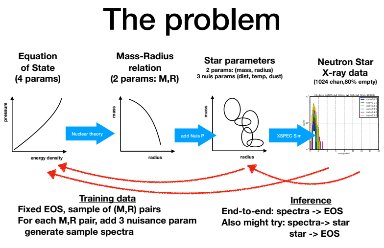

# Neutron Stars


## Set Up
```bash
git clone https://github.com/jordanott/NeutronStars.git

# You'll need to download the onnx file from here: 
# https://drive.google.com/file/d/1vcOBmjZ4knSJUayr4zb6uoC5Z2HLnBwK/view?usp=sharing
mv ~/Downloads/model.onnx NeutronStars/SavedModels/mr+star2spectra/00069/

# Create a python virtual environment (Optional)
python3 -m venv neutron_stars_env
alias ns_env=neutron_stars_env/bin/python

# Upgrade pip (needed for some packages)
ns_env -m pip install -U pip

# Install the necessary requirements to your virtual environment
ns_env -m pip install -r requirements.txt

# Installs the neutron stars pip package I've created
ns_env -m pip install -Ue .
```

## 1) Make predictions on a large batch of files

### Preprocess the data
```bash
# Extract data from gz file
# I'll use directories on our machines as an example (replace with your own)
# The result of this step must be a directory with .dat or .dat.gz files
tar -xvzf /baldig/physicstest/NeutronStarsData/res.tgz

# Preprocesses data into necessary format to be read
ns_env neutron_stars/data_loader/data_parser.py --data_dir /baldig/physicstest/NeutronStarsData/res/

# The result of preprocessing should be new files with the extension .npz 
$ ls /baldig/physicstest/NeutronStarsData/res | head
skip0-num10-spectra_2Param_MR.dat.gz
skip0-num10-spectra_2Param_MR.npz
skip0-num10-spectra_4Param_MR.dat.gz
skip0-num10-spectra_4Param_MR.npz
```

### Using the Model

```bash
ns_env test_scripts/mr_np_to_spectra.py \
--data_dir /baldig/physicstest/NeutronStarsData/res_nonoise10x/ \
--load_settings_from SavedModels/mr+star2spectra/00011/00011.json
```

### Parsing the Results
The inputs, targets, and network predictions are saved in a csv file. You can examine them like this:
```python
import pandas as pd
df = pd.read_csv('Predictions/all_00011_01.csv', index_col=0)

input_cols = ['Mass', 'Radius', 'nH', 'logTeff', 'dist']
true_cols = list(map(str, range(250)))
pred_cols = ['pred_' + col for col in true_cols]

inputs = df[input_cols]
targets = df[true_cols]
predictions = df[pred_cols]
```

To make plots like the ones I emailed:
```python
import numpy as np
import matplotlib.pyplot as plt

idxs = np.random.choice(np.arange(len(df)), 50)
true_spectra = df[true_cols].values
pred_spectra = df[pred_cols].values

plt.subplot(1,2,1); plt.title('True Spectra')
plt.plot(true_spectra[idxs].T)

plt.subplot(1,2,2); plt.title('Predicted Spectra')
plt.plot(np.maximum(pred_spectra[idxs].T, 0))
```

## 2) Make predictions given mass, radius, nH, logTeff, dist
```python
import neutron_stars as ns
import matplotlib.pyplot as plt

spectra_generator = ns.SpectraGenerator()
spectra = spectra_generator(mass=2.581471, radius=12.089365,
                            nH=0.013734, logTeff=6.273879, dist=6.011103)

plt.plot(spectra.T)
plt.savefig('example_generated_spectra.png')
```

## [ONNX Conversion](https://github.com/onnx/tensorflow-onnx)
This is a reference for myself, others can ignore it
```bash
tf2 -m tf2onnx.convert --saved-model tensorflow-model-path --output model.onnx
```